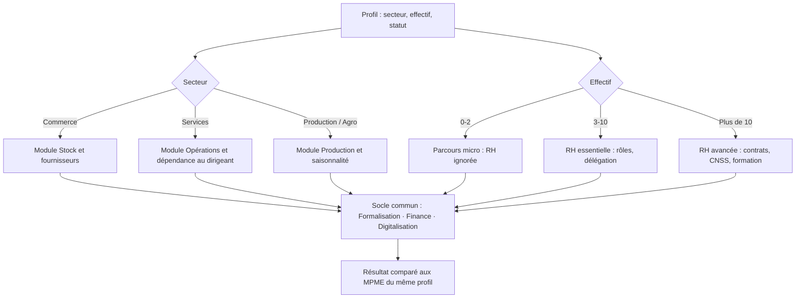

# Réflexion produit (bonus) : du questionnaire au premier maillon de la donnée ALODO

Le prototype répond à la consigne. En le construisant, j'ai identifié **trois limites** du diagnostic tel qu'il est posé, et une piste pour chacune.

---

## 1. Un même questionnaire ne convient pas à toutes les MPME → diagnostic adaptatif

**Le problème.** Une vendeuse de pagnes au marché Dantokpa et une PME de transformation agroalimentaire de 25 salariés ne doivent pas répondre aux mêmes questions. Demander « avez-vous des contrats de travail ? » à une entreprise sans salarié fait perdre du temps et décrédibilise l'outil. À l'inverse, ne pas poser la question des stocks à un commerçant revient à passer à côté de son premier frein.

**La proposition.** Commencer par 3 questions de profil **non notées**, qui choisissent les modules à afficher :



**Ce que le prototype prépare déjà.** Chaque question porte ses informations en attributs HTML (`data-dimension`, `data-weight`). Il suffirait d'ajouter une condition, par exemple `data-sector="commerce"`, et de n'afficher dans `app.js` que les questions correspondant au profil. Le calcul fonctionne déjà question par question, quel que soit leur nombre.

**Bénéfice.** Moins de questions par personne (entre 8 et 10 au lieu de plus de 40 pour couvrir les 8 dimensions), et un score comparable **entre entreprises du même profil** plutôt qu'avec une norme unique.

---

## 2. Un diagnostic déclaratif n'est pas fiable → indice de confiance

**Le problème.** Tout le monde a tendance à se surévaluer. « Je note mes ventes chaque jour » ne vaut pas la même chose qu'un relevé Mobile Money de 12 mois. Or ALODO veut, à terme, relier ces données à des **opportunités financières** : un score déclaratif ne suffira pas à un partenaire financier.

**La proposition.** Afficher deux chiffres :

| | Score de maturité | Indice de confiance |
|---|---|---|
| Question | *Où en est l'entreprise ?* | *À quel point peut-on le croire ?* |
| Exemple | 64/100 | 35 % |

Chaque réponse aurait un niveau de preuve :

| Niveau | Exemple | Coefficient |
|---|---|---|
| Déclaré | « Oui, je tiens un cahier » | × 0,5 |
| Justifié | Photo du cahier ou du RCCM | × 0,8 |
| Vérifié par un conseiller | Visite de terrain ALODO | × 0,9 |
| Vérifié par la donnée | Relevé Mobile Money, transactions du **boîtier ALODO** | × 1 |

**Le lien avec ALODO.** C'est ici que le diagnostic devient stratégique : il ne s'arrête plus à un rapport, il devient **la porte d'entrée vers le boîtier ALODO et le scoring de crédit**. La recommandation « Construire un historique de ventes vérifiable » peut déboucher directement sur « Équipez-vous du boîtier ALODO ». L'indice de confiance augmente alors mois après mois, automatiquement.

---

## 3. Un diagnostic ponctuel ne mesure pas l'accompagnement → suivi dans le temps

**Le problème.** Le parcours se termine par *Accompagnement*, mais rien ne permet de savoir si l'accompagnement a fonctionné. Avec une première cohorte de 20 MPME, c'est justement le moment de le prouver, auprès des MPME comme des partenaires (TechnoServe, bailleurs).

**La proposition.**
- **Un nouveau diagnostic identique à 3 et 6 mois** : même questions, pour comparer ce qui est comparable.
- **Actions suivies** : chaque recommandation devient une tâche que la MPME marque « faite », avec un rappel sur WhatsApp.
- **Vue cohorte pour l'équipe ALODO** : progression moyenne par dimension, freins les plus fréquents, MPME qui décrochent. Par exemple : « 14 MPME sur 20 mélangent argent pro et perso », ce qui justifie un atelier collectif plutôt que 14 accompagnements individuels.

```
Diagnostic T0 ──▶ 3 actions ──▶ Rappels WhatsApp ──▶ Diagnostic T+3 mois ──▶ Progression mesurée
     52/100                                                  67/100              +15 pts (Finance +22)
```

---

## Autres pistes, plus courtes

- **Diagnostic directement sur WhatsApp.** La cible y est déjà et n'aura rien à installer. Les mêmes questions et la même logique de score pourraient être posées une par une par un chatbot.
- **Mode audio et langues locales** (fon, yoruba, dendi…) pour les dirigeants peu à l'aise avec l'écrit.
- **Mode conseiller hors ligne** : un agent ALODO fait passer le diagnostic sur tablette en zone mal couverte, puis synchronise les réponses une fois connecté.
- **Calibrage des barèmes** : après les 20 premiers diagnostics, comparer les scores au jugement des conseillers et ajuster les poids. Le scoring doit être appris, pas seulement décrété.

## Ordre de priorité proposé

1. **Indice de confiance** : c'est la condition pour relier le diagnostic au financement, cœur de la vision ALODO.
2. **Suivi dans le temps** : c'est la preuve d'impact de la cohorte pilote.
3. **Parcours adaptatif** : indispensable dès que l'on dépasse quelques dizaines de MPME aux profils variés.
